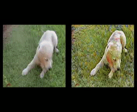

# Styled Video Generator
The Styled Video Generator is a project that generates a video from a given set of short video clips. 
The generator can also apply style translations to the video (e.g. painting-like videos).

## Prerequisites
- A CUDA compatible GPU is highly recommended
- Python 3
- Python packages [Torch](https://pypi.org/project/torch/) | [Torchvision](https://github.com/pytorch/vision) | 
  [Pandas](https://pandas.pydata.org/) | [Pillow](https://python-pillow.org/) | [NumPy](https://numpy.org/) | 
  [Decord](https://github.com/dmlc/decord) | [MoviePy](https://pypi.org/project/moviepy/)

## Getting Started
### Installation
- Clone this repo:
```bash
git clone https://github.com/williamhxy/styled_video_generator
```

- Initialize the submodule "pytorch-CycleGAN-and-pix2pix":
```bash
git submodule init
```

- Update the submodule "pytorch-CycleGAN-and-pix2pix":
```bash
git submodule update
```

### Initialize
Run the "initialize.py" script in the root folder to generate the classification label record.  
{path_to_the_video_dataset} is the path to the video dataset folder.
```bash
python initialize.py {path_to_the_video_dataset}
```

### Generate
Run the "generate.py" script in the root folder to generate the translated output video.  
{path_to_the_video_dataset} is the path to the video dataset folder.  
{length_of_output_video_in_second} is the video length in second as an integer.  
{video_frame_rate} is the frame rate per second as an integer
```bash
python generate.py {path_to_the_video_dataset} {length_of_output_video_in_second} {video_frame_rate}
```

## Folder Structure
- data: Folder used to keep temporary data and metadata. 
- extern: All submodule repositories are here. 
- models: Pre-trained CycleGAN models for running the image translation. 
- results: The outputs from the algorithm.
- scripts: All supporting scripts are here. 

## Acknowledgments
- An overview and reference to the CycleGAN model can be found [here](https://junyanz.github.io/CycleGAN/).
- The CycleGAN model repository can be found [here](https://github.com/junyanz/pytorch-CycleGAN-and-pix2pix).
- The video to image processing in this project uses the [decord](https://github.com/dmlc/decord) code. 


